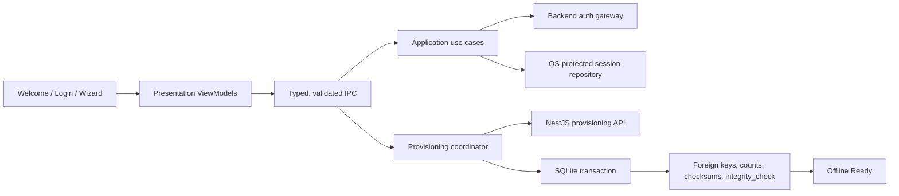
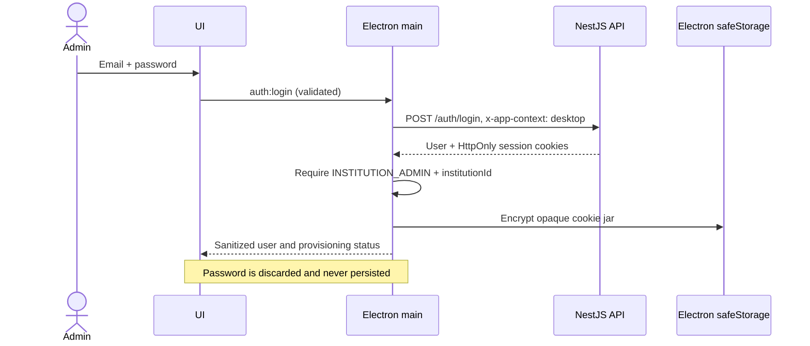
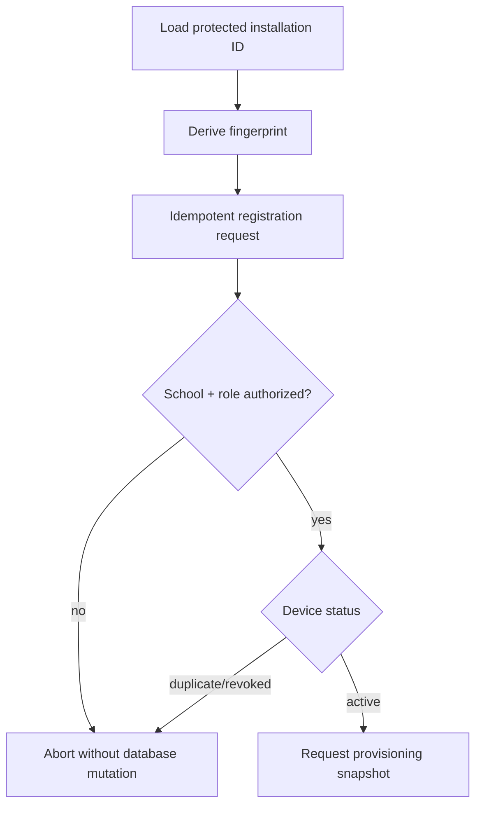
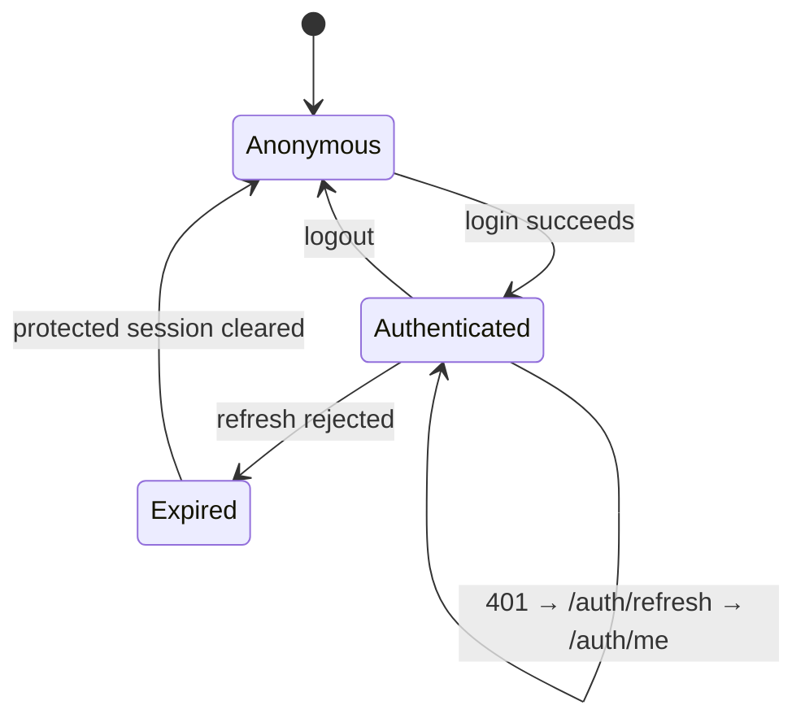

# Initial Device Provisioning

## Readiness summary

The authoritative NestJS device and snapshot contracts and the complete
desktop workflow are implemented. A fresh installation can authenticate,
idempotently register and verify its device, download a repeatable-read school
snapshot, verify its SHA-256 checksum and manifest, atomically initialize the
encrypted SQLite database, verify counts/relationships/foreign keys/database
integrity, persist completion metadata, and enter Offline Mode.

## 1. Provisioning architecture



Trust boundaries:

- React never sees refresh tokens or response cookies.
- The preload exposes only the four provisioning/authentication operations.
- Every IPC input is exact-shape and bounded before entering application code.
- Backend authorization remains authoritative.
- SQLite is not mutated until registration and a complete snapshot have both
  been verified.

## 2. Authentication workflow



The existing backend contracts used without modification are:

- `POST /auth/login`
- `POST /auth/refresh`
- `GET /auth/me`
- `POST /auth/logout`

The main process maintains the cookie contract because Node `fetch` has no
ambient browser cookie jar. Only cookie name/value pairs are retained; cookie
material is serialized as an opaque secret and encrypted at rest.

## 3. Device registration workflow

The desktop creates a stable installation UUID protected by `safeStorage`, then
derives a SHA-256 fingerprint from the installation ID and OS/device
characteristics. It displays the device name, OS, application version, and
fingerprint-ready identity before registration.

Registration uses the authoritative `POST /desktop/devices` and
`GET /desktop/devices/:id` contracts:



The client must not define duplicate-device, maximum-device, approval, or
revocation rules. Those belong to the backend.

## 4. Provisioning sequence

```mermaid
sequenceDiagram
  participant UI
  participant Main
  participant API
  participant DB as Encrypted SQLite

  UI->>Main: Authenticate
  Main->>API: Existing auth endpoints
  API-->>Main: Authorized administrator
  UI->>Main: Start provisioning
  Main->>API: Register/verify device
  Main->>API: Download versioned snapshot
  API-->>Main: Payload + manifest + checksum
  Main->>DB: BEGIN IMMEDIATE; import in dependency order
  Main->>DB: foreign_key_check + integrity_check + manifest counts
  alt valid
    Main->>DB: Store provisioning/sync metadata; COMMIT
    Main-->>UI: Ready
  else invalid/interrupted
    Main->>DB: ROLLBACK
    Main-->>UI: Recoverable failure
  end
```

## 5. Session lifecycle



Session restoration verifies the server session and current user on every
application start. A failed refresh clears local session material. Logout
clears local state in a `finally` path even if the network is unavailable.
Automatic entry into the dashboard is permitted only when both the session is
authenticated and provisioning metadata says the device is complete.

## 6. Download strategy

`GET /desktop/provisioning/snapshot?deviceId=…` returns one versioned snapshot
under a PostgreSQL repeatable-read transaction rather than independently
calling mutable list endpoints. It includes:

- a schema/contract version;
- device and institution identifiers;
- a stable snapshot identifier;
- entity manifests with counts and deterministic dependency order;
- a SHA-256 checksum covering the exact data object;
- a server-issued generation time.

Resume is safe only at verified chunk boundaries. Staging tables or a temporary
encrypted database should be used for very large schools; promotion to the
live database must be atomic. The desktop must import only entities actually
declared in the backend contract.

## 7. Security considerations

- Passwords are never logged or persisted.
- Refresh/session cookies remain in the main process and are encrypted by
  Windows DPAPI through Electron `safeStorage`.
- Production configuration rejects a missing API URL and non-HTTPS API URLs.
- The renderer receives a sanitized user profile, never cookies or tokens.
- Context isolation, renderer sandboxing, disabled Node integration, CSP,
  permission denial, typed IPC, exact-shape validators, and SQLCipher remain in
  force.
- Device fingerprinting is an identifier, not proof of possession. The future
  registration contract should issue a server-bound device credential and
  define rotation/revocation.
- Snapshot integrity requires a server-authenticated checksum/signature; local
  row counts alone cannot establish authenticity.

## 8. Recovery strategy

- Invalid credentials: remain on login; do not retain the password.
- Network interruption during authentication: keep the device unprovisioned.
- Expired session: attempt refresh once, then clear protected session state.
- Duplicate/revoked/unauthorized device: stop before downloading.
- Interrupted download: retain only verified resumable chunks, otherwise
  discard staging data.
- Migration or import failure: rollback the transaction and preserve the prior
  database.
- Failed verification: rollback, log technical detail, display a stable
  user-facing recovery message.
- Interrupted or invalid snapshots never replace the prior local dataset.

## 9. Delivered backend contracts and technical debt

- `POST /desktop/devices` — authenticated, institution-scoped, idempotent
  registration with duplicate fingerprint and revocation enforcement.
- `GET /desktop/devices/:id` — institution-scoped authorization and device
  status.
- `GET /desktop/provisioning/snapshot` — versioned, repeatable-read,
  institution-scoped dataset with manifest and checksum.

Remaining technical debt is non-blocking for Phase 13:

- Add signed snapshots if deployments require protection beyond authenticated
  TLS plus SHA-256 transport/integrity validation.
- Add streamed/chunked snapshots for schools whose payloads exceed the
  established operational size threshold.
- Check revocation at each future synchronization boundary.
- Add a CI installer smoke test against a dedicated provisioning tenant and
  deployed PostgreSQL instance.

## 10. Phase 13 readiness assessment

| Capability | Status |
| --- | --- |
| Welcome/login/wizard UI | Ready |
| Existing backend authentication integration | Ready |
| Protected session persistence and restoration | Ready |
| Refresh, expiration handling, and logout | Ready |
| Stable local device identity/fingerprint | Ready |
| Role and institution authorization | Ready |
| Device registration/verification | Ready |
| Provisioning download contract | Ready |
| Atomic SQLite population and data verification | Ready |
| Fresh installer end-to-end provisioning | Ready for deployment smoke test |
| Continuous synchronization/conflict resolution | Explicitly out of scope |

Phase 13 is ready to begin. Continuous synchronization must reuse the stored
server device ID, snapshot/checksum metadata, sync metadata singleton, and
existing per-row version/device columns; conflict resolution remains explicitly
outside this provisioning phase.
