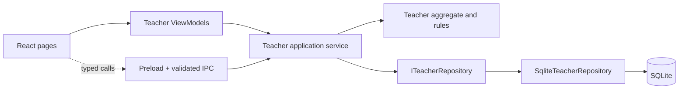
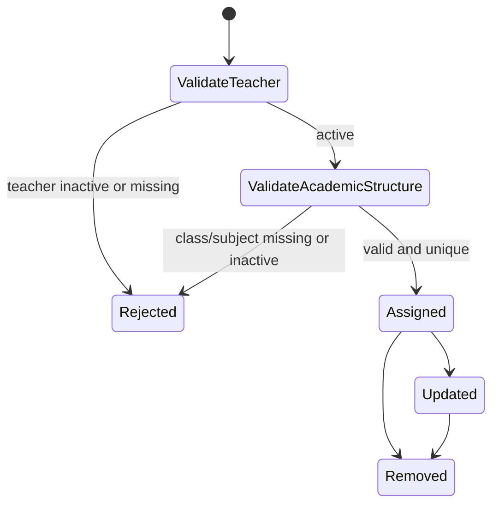
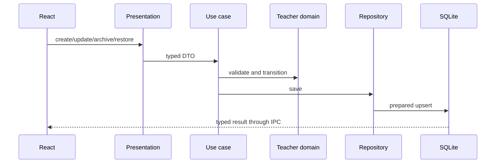

# Teacher Management and Teaching Assignments

## Architecture

`Staff` is the backend's authoritative teacher record. The desktop mirrors the
Prisma `Staff`, `SubjectTeacher`, `ClassTeacher`, and `ClassSubjectTeacher`
models; no desktop-only business entity or assignment status was introduced.

## Teaching assignment architecture

Subject teaching uses `class_subject_teachers` and ensures the reusable
`subject_teachers`, `class_teachers`, and `class_subjects` relations exist.
Homeroom/class-teacher responsibility uses `class_teachers.isClassTeacher`, and
assigning a new homeroom teacher demotes the previous one as the backend does.
Academic year and grade are derived from the assigned class, which prevents
contradictory denormalized values.

## CRUD lifecycle

Implemented use cases: `CreateTeacher`, `UpdateTeacher`, `ArchiveTeacher`,
`RestoreTeacher`, `SearchTeachers`, `GetTeacherProfile`,
`GetTeachingAssignments`, `AssignTeacher`, `UpdateAssignment`,
`RemoveAssignment`, and `GetTeacherDashboard`.

Repository additions include indexed paged search, batch assignment joins,
duplicate constraints, dashboard aggregates, prepared statements, and local
version/device metadata for future provisioning and synchronization.

IPC endpoints use the `teacher:*` namespace and validate exact shapes:
`list`, `get-profile`, `create`, `update`, `set-active`, `list-assignments`,
`assign`, `update-assignment`, `remove-assignment`, and `get-dashboard`.

The dashboard now reads total teachers, assignments, unassigned teachers,
subject/grade/employment breakdowns, and recently added teachers from SQLite.

## Performance and integration readiness

Search is SQL-paged and indexed by institution, name, employment/active state,
position, and update time. Assignment foreign keys are indexed for timetable,
attendance, assessment, and provisioning reads. UI lists render one page at a
time and academic selectors reuse the Academic Foundation ViewModel.

Phase 12 can provision the four backend-aligned tables directly and preserve
server UUIDs. Remaining technical debt: synchronize changes and conflicts,
attach a real audit/user identity to `lastModifiedBy`, expose bulk import, and
add documents/timeline/payroll/leave only when their backend models exist.
