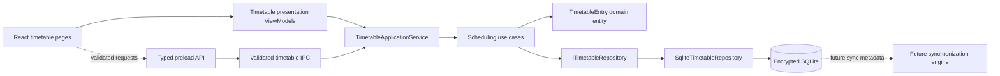
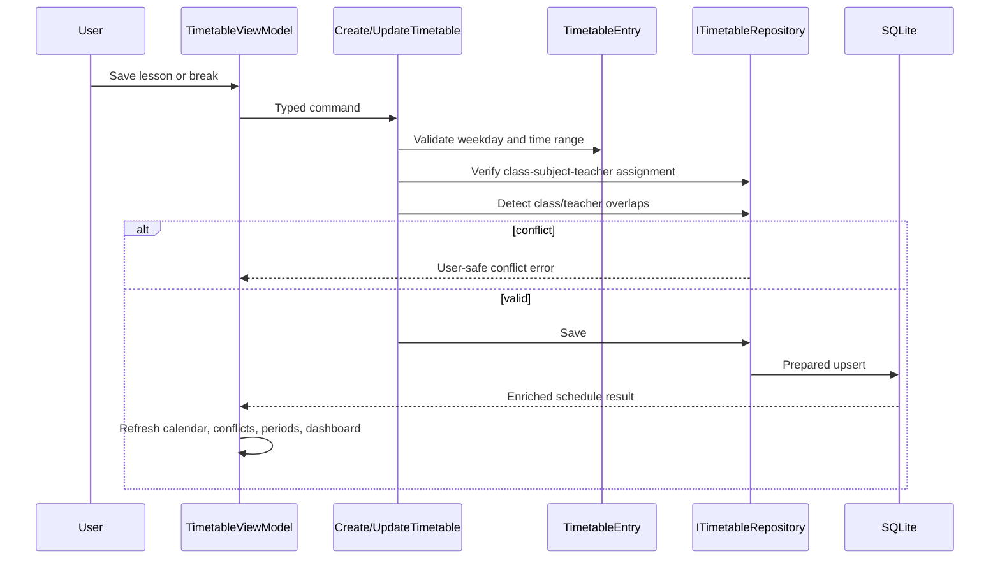
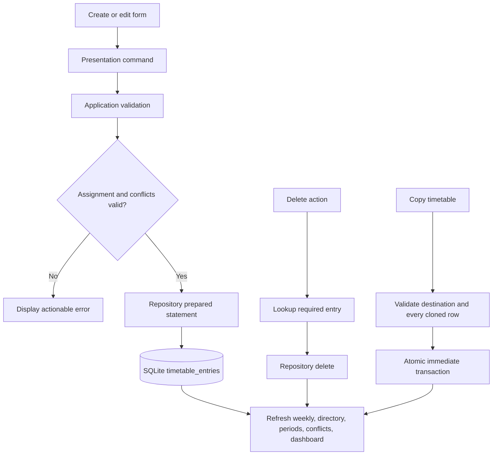

# Phase 13 — Timetable Management

## Readiness

The supported timetable core is implemented offline-first and mirrors the backend
`TimetableEntry` model. It is the desktop scheduling source for class, teacher,
and subject weekly views. No desktop-only scheduling entity was introduced.

## 1. Architecture

React never calls IPC, repositories, or SQLite directly. The renderer uses the
presentation layer, whose IPC-backed application facade has the same shape as the
main-process application layer.

## 2. Scheduling workflow

## 3. Conflict detection strategy

- Times are strict zero-padded 24-hour `HH:MM` strings.
- Overlap uses `candidate.start < existing.end` and
  `candidate.end > existing.start`; adjacent periods are allowed.
- A class cannot have overlapping entries, including overlapping breaks.
- A teacher cannot have overlapping non-break lessons across classes.
- A non-break lesson requires an existing `class_subject_teachers` assignment.
- Breaks contain no subject, teacher, assignment, or room.
- SQLite constraints enforce valid weekdays, increasing times, foreign keys, and
  the backend uniqueness rule `(classId, dayOfWeek, startTime)`.
- Copying a class schedule is one immediate transaction. Each lesson resolves
  the destination class's teacher for that subject rather than copying the
  source teacher blindly. A missing destination assignment or any conflict
  rolls the whole copy back.
- The backend separately serializes institution timetable writes with a
  PostgreSQL advisory transaction lock.

Subject simultaneity is not treated as a conflict because the backend does not
define a subject-capacity constraint. Conflict resolution is intentionally not
implemented.

## 4. CRUD flow

The backend supports hard delete only. Archive/restore was not created locally.

## 5. Use cases

- `CreateTimetable`
- `UpdateTimetable`
- `DeleteTimetable`
- `CopyTimetable`
- `SearchTimetables`
- `GenerateWeeklySchedule`
- `GetTeacherSchedule`
- `GetClassSchedule`
- `GetSubjectSchedule`
- `ValidateTimetable`
- `DetectScheduleConflicts`
- `GetTimetablePeriods`
- `GetTimetableDashboard`

All depend on repository interfaces rather than SQLite.

## 6. Repository additions

`ITimetableRepository` and `SqliteTimetableRepository` provide:

- Enriched timetable paging and keyword/filter search.
- Class, teacher, subject, academic-year, grade, weekday, and sort filters.
- Prepared create/update/delete statements.
- Indexed teacher/class overlap queries.
- Assignment checks.
- Atomic class timetable copy.
- Derived period/bell rows.
- Dashboard aggregation and teacher workload.

Migration `007-create-timetable-management-tables` mirrors the backend
`timetable_entries` table and adds indexes for the desktop query paths.
Provisioning contract version 1 now includes `timetableEntries`, allowing fresh
devices to receive the server timetable within the same checksummed atomic import.

## 7. IPC endpoints

| Channel | Purpose |
| --- | --- |
| `timetable:list` | Search/filter/paginate timetable entries |
| `timetable:class` | Weekly class schedule |
| `timetable:teacher` | Weekly teacher schedule |
| `timetable:subject` | Weekly subject schedule |
| `timetable:create` | Create lesson or break |
| `timetable:update` | Edit an entry |
| `timetable:delete` | Delete an entry |
| `timetable:copy` | Atomically copy a class timetable |
| `timetable:validate` | Validate a proposed entry |
| `timetable:conflicts` | Scan the current filtered schedule |
| `timetable:periods` | Derive ordered periods |
| `timetable:dashboard` | Return real schedule metrics |

Every channel has strict arity, allow-listed keys, bounded strings, enum checks,
and time-format validation.

## 8. Dashboard enhancements

The school dashboard and timetable dashboard use real SQLite aggregates:

- Total timetable entries.
- Today's scheduled entries.
- Classes scheduled today.
- Pending stored conflicts.
- Teacher workload summary.

No sample or fallback scheduling data is used.

## 9. Performance

- Composite class/day/start and staff/day/start/end indexes support grids and
  overlap checks.
- Subject/day, institution, update, and assignment indexes support filters and
  future delta synchronization.
- Repository statements are cached and parameterized.
- Results are paginated at the directory boundary.
- Weekly rendering groups only the selected result set.
- Dashboard counts execute in SQLite rather than loading all rows into React.
- The initial provisioning import remains one checksummed transaction.

## 10. Backend gap analysis and technical debt

The backend has `TimetableEntry`, but does **not** have:

- A named `Timetable` aggregate or timetable directory/version entity.
- Direct `academicYearId` or `termId` on an entry. Academic year is derived
  through `Class`; term-specific schedules cannot be represented.
- Standalone bell schedule or period entities. Periods are derived from entry
  start/end times, as in the current web implementation.
- Timetable lifecycle status, archive, or restore.
- Timetable version history.
- A room entity; only optional room text is supported.
- Special-event types; breaks/lunch/assembly can only use `isBreak`.
- A backend copy endpoint. Desktop copy is local and future sync will need an
  agreed bulk mutation contract.
- A backend conflict-read endpoint. Existing backend validation rejects
  conflicts during writes.

These gaps block independent bell-schedule CRUD, term-specific timetables,
versioning, archive/restore, and structured room allocation. Adding any of them
requires backend schema/API decisions before desktop expansion.

## 11. Future consumers and Phase 14 readiness

Attendance can consume `classId + dayOfWeek + startTime/endTime` to identify the
scheduled class context. Assessments can consume class/subject/teacher schedule
queries for planning without changing the current layers. Future synchronization
can use stable UUIDs, `version`, `updatedAt`, `lastModifiedBy`, and `deviceId`.

Phase 14 is ready at the architecture boundary once the intended Phase 14 scope
accepts the backend gaps above. Attendance, assessments, synchronization, and
conflict resolution were not implemented in Phase 13.
